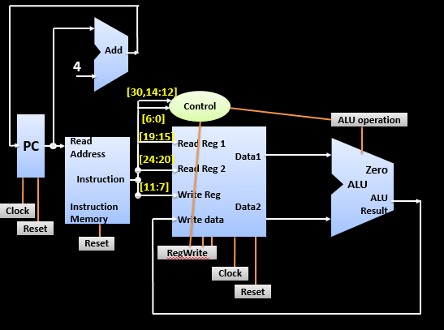

# 🚀 RISC-V Processor Implementation

> *A complete 32-bit RISC-V processor design with support for RV32I base instruction set*

[](https://en.wikipedia.org/wiki/Verilog)
[](https://riscv.org/)
[](https://opensource.org/licenses/MIT)

---

## 📖 Overview

This project implements a **32-bit RISC-V processor** in Verilog HDL, featuring a modular single-cycle architecture that supports the RV32I base integer instruction set. The processor can execute arithmetic, logical, memory access, and control flow instructions, making it suitable for educational purposes and embedded system applications.

The design emphasizes modularity, with each functional unit (ALU, Control Unit, Register File, etc.) implemented as separate, testable components that integrate seamlessly into the complete processor pipeline.

## 🎯 Motivation

This project was developed to:
- **Understand CPU architecture** at the hardware level by implementing a fully functional processor from scratch
- **Learn RISC-V ISA** - one of the most important open-source instruction set architectures
- **Practice RTL design** using Verilog HDL with proper coding standards
- **Explore digital design principles** including datapath construction, control logic, and memory systems
- **Create a foundation** for future enhancements like pipelining, caching, and performance optimizations

## ✨ Features

### Core Components

#### 🧮 **Arithmetic Logic Unit (ALU)**
- 32-bit operand support with 9 operations:
  - Bitwise operations: AND, OR, XOR
  - Arithmetic: ADD, SUB, MUL
  - Shift operations: SLL (Shift Left Logical), SRL (Shift Right Logical)
  - Comparison: SLT (Set on Less Than)
- Zero flag generation for branch condition evaluation
- 4-bit operation control encoding

#### 📝 **Register File**
- 32 general-purpose registers (x0-x31), each 32-bits wide
- x0 hardwired to zero (RISC-V convention)
- Dual read ports (rs1, rs2) for simultaneous access
- Single write port with enable signal
- Positive edge-triggered write operations

#### 🎛️ **Control Unit**
- Complete instruction decoder for RV32I ISA
- Supports multiple instruction formats:
  - **R-type**: Register-register operations
  - **I-type**: Immediate operations and loads
  - **S-type**: Store instructions
  - **B-type**: Branch instructions
  - **U-type**: Upper immediate (LUI, AUIPC)
  - **J-type**: Jump instructions (JAL, JALR)
- Generates control signals: `regwrite`, `alu_src`, `mem_read`, `mem_write`, `mem_to_reg`, `branch`, `jump`

#### 🔢 **Immediate Generator (IMM_GEN)**
- Extracts and sign-extends immediate values from instructions
- Handles all 5 instruction formats (I, S, B, U, J)
- Proper bit manipulation for RISC-V encoding standards

#### 🗂️ **Instruction Memory (INST_MEM)**
- Byte-addressable memory with 32 locations
- Hardcoded test programs for verification
- Outputs 32-bit instruction words to the processor

#### 💾 **Data Memory (DATA_MEM)**
- 256 bytes of byte-addressable memory
- Supports multiple access sizes:
  - LW/SW: Word (32-bit)
  - LH/SH: Halfword (16-bit)
  - LB/SB: Byte (8-bit)
  - Unsigned variants: LHU, LBU
- Clock-synchronized write operations

#### 🔀 **Branch Unit**
- Evaluates branch conditions for all branch types:
  - BEQ (Branch if Equal)
  - BNE (Branch if Not Equal)
  - BLT/BLTU (Branch if Less Than - signed/unsigned)
  - BGE/BGEU (Branch if Greater or Equal - signed/unsigned)
- Calculates branch target addresses
- Handles JAL and JALR jump instructions

#### 🔄 **Instruction Fetch Unit (IFU)**
- Program Counter (PC) management
- PC increment logic (PC + 4)
- Branch/jump target handling
- Instruction memory interface

#### 🔗 **Datapath**
- Connects Register File and ALU
- Multiplexer for ALU source selection (register vs. immediate)
- Write-back multiplexer (ALU result vs. memory data)
- Data forwarding paths

### Instruction Set Support

| Category | Instructions Supported |
|----------|------------------------|
| **Arithmetic** | ADD, ADDI, SUB, MUL |
| **Logical** | AND, ANDI, OR, ORI, XOR, XORI |
| **Shift** | SLL, SLLI, SRL, SRLI |
| **Comparison** | SLT, SLTI |
| **Memory Load** | LW, LH, LB, LHU, LBU |
| **Memory Store** | SW, SH, SB |
| **Branch** | BEQ, BNE, BLT, BGE, BLTU, BGEU |
| **Jump** | JAL, JALR |
| **Upper Immediate** | LUI, AUIPC |

## 🖼️ Block Diagram

<!-- Insert the processor architecture block diagram here -->


*Figure 1: Complete processor architecture showing all major components and their interconnections*


*Figure 2: Simulation waveforms showing instruction execution*

## 🚀 Getting Started

### Prerequisites

To simulate and test this processor, you'll need:
- **Icarus Verilog** (iverilog) - for compilation
- **GTKWave** - for waveform visualization
- Alternatively: **ModelSim**, **Vivado**, or any Verilog simulator

### Installation

```bash
# Install Icarus Verilog (Ubuntu/Debian)
sudo apt-get install iverilog gtkwave

# Install Icarus Verilog (macOS)
brew install icarus-verilog gtkwave

# For Windows, download from:
# http://bleyer.org/icarus/
```

### Running the Simulation

#### Option 1: Compile and Run the Complete Processor

```bash
# Navigate to the Processor folder
cd "Processor"

# Compile the testbench (includes all modules)
iverilog -o processor-sim Processor_tb.v

# Run the simulation
vvp processor-sim

# View waveforms
gtkwave output_wave.vcd
```

#### Option 2: Test Individual Modules

```bash
# Example: Testing the ALU
cd "ALU"
iverilog -o alu-sim ALU_testbench.v
vvp alu-sim
gtkwave output_wave.vcd

# Example: Testing the Register File
cd "../Register file"
iverilog -o regfile-sim "Register File_tb.v"
vvp regfile-sim
gtkwave output_wave.vcd

# Example: Testing the Datapath
cd "../Datapath"
iverilog -o datapath-sim Datapath_tb.v
vvp datapath-sim
gtkwave output_wave.vcd
```

#### Option 3: Using PowerShell (Windows)

```powershell
# Navigate to Processor folder
cd "Processor"

# Compile and simulate
iverilog -o processor-sim.exe Processor_tb.v
.\processor-sim.exe

# View waveforms
gtkwave output_wave.vcd
```

## 📁 Project Structure

```
RISC-V-Processor/
│
├── 📄 README.md                      # This file
├── 📄 .github/
│   └── copilot-instructions.md       # Development guidelines
│
├── 📁 ALU/                           # Arithmetic Logic Unit
│   ├── ALU.v                         # ALU implementation
│   ├── ALU_testbench.v               # ALU test cases
│   └── output_wave.vcd               # Simulation waveforms
│
├── 📁 Control Unit/                  # Instruction Decoder
│   └── CONTROL.v                     # Control signal generation
│
├── 📁 Register file/                 # Register File Module
│   ├── REG_FILE.v                    # 32x32-bit register array
│   ├── Register File_tb.v            # Register file testbench
│   └── output_wave.vcd
│
├── 📁 Instruction Fetch Unit/        # Program Counter & Instruction Memory
│   ├── IFU.v                         # Instruction fetch logic
│   ├── IFU_tb.v                      # IFU testbench
│   ├── INST_MEM.v                    # Instruction memory
│   ├── INST_MEM_tb.v                 # Memory testbench
│   └── output_wave.vcd
│
├── 📁 Datapath/                      # Register File + ALU Integration
│   ├── DATAPATH.v                    # Datapath connections
│   ├── Datapath_tb.v                 # Datapath testbench
│   └── output_wave.vcd
│
├── 📁 Processor/                     # Complete Processor Integration
│   ├── PROCESSOR.v                   # Top-level module
│   ├── Processor_tb.v                # Full processor testbench
│   ├── ALU.v                         # ALU (copied for integration)
│   ├── CONTROL.v                     # Control unit
│   ├── DATAPATH.v                    # Datapath
│   ├── IFU.v                         # Instruction fetch unit
│   ├── INST_MEM.v                    # Instruction memory
│   ├── REG_FILE.v                    # Register file
│   ├── IMM_GEN.v                     # Immediate generator
│   ├── BRANCH_UNIT.v                 # Branch logic
│   ├── DATA_MEM.v                    # Data memory
│   └── output_wave.vcd               # Complete simulation waveforms
│
└── 📁 images/                        # Documentation images
    ├── Processor.png                 # Architecture diagram
    ├── RISCV.png                     # RISC-V logo/reference
    └── Waveform.png                  # Sample waveforms
```

### Module Descriptions

| Module | Description |
|--------|-------------|
| `PROCESSOR.v` | Top-level integration connecting IFU → CONTROL → DATAPATH |
| `IFU.v` | Manages Program Counter and fetches instructions |
| `INST_MEM.v` | Stores program instructions (32 locations) |
| `CONTROL.v` | Decodes instructions and generates control signals |
| `DATAPATH.v` | Connects Register File, ALU, and multiplexers |
| `REG_FILE.v` | 32 registers with dual read/single write ports |
| `ALU.v` | Performs arithmetic and logical operations |
| `IMM_GEN.v` | Extracts and sign-extends immediate values |
| `BRANCH_UNIT.v` | Evaluates branch conditions and calculates targets |
| `DATA_MEM.v` | Byte-addressable data memory (256 bytes) |

## 🧪 Testing & Verification

### Testing Methodology

Each module includes a dedicated testbench that verifies its functionality:

1. **Unit Testing**: Individual modules tested in isolation
   - ALU operations verified with various input combinations
   - Register file tested for read/write operations
   - Memory modules tested for correct addressing

2. **Integration Testing**: Processor-level testing with sample programs
   - Test programs hardcoded in instruction memory
   - Testbenches simulate clock cycles and monitor register changes
   - Waveform analysis using GTKWave

### Sample Test Program

The instruction memory contains test instructions like:

```verilog
// Example: ADD x3, x1, x2
memory[0] = 8'b00000000;  // funct7 (lower byte)
memory[1] = 8'b00100000;  // rs2 = 2
memory[2] = 8'b00001000;  // rs1 = 1, funct3 = 000
memory[3] = 8'b10110011;  // rd = 3, opcode = 0110011

// More instructions follow...
```

### Verification Approach

- **Clock Period**: 40ns (25 MHz)
- **Reset Duration**: 50ns initial high
- **Simulation Time**: 300-500ns depending on test
- **Waveform Analysis**: All signals dumped to VCD files
- **Expected Results**: Verified by observing register file values and memory contents

### Running Specific Tests

```bash
# Test arithmetic operations
cd Processor
iverilog -o test Processor_tb.v
vvp test

# Verify register values after execution
# Check output_wave.vcd in GTKWave
gtkwave output_wave.vcd
```

## 🔮 Future Improvements

### Phase 1: Enhanced Verification ✅ (Completed)
- [x] Complete RV32I base instruction set
- [x] Implement I-type, Load/Store, Branch, Jump instructions
- [x] Add Immediate Generator
- [x] Add Data Memory module
- [x] Add Branch Unit

### Phase 2: Assembly-Based Testing (Planned)
- [ ] Transition to RISC-V assembly workflow
- [ ] Use RISC-V GNU Toolchain for program assembly
- [ ] Implement `$readmemh` for loading machine code from files
- [ ] Develop self-checking testbenches with PASS/FAIL indicators

### Phase 3: Performance Optimization (Planned)
- [ ] Convert to **5-stage pipeline** (IF, ID, EX, MEM, WB)
- [ ] Add pipeline registers between stages
- [ ] Implement **Hazard Detection Unit**
- [ ] Add **data forwarding (bypassing)** logic
- [ ] Implement **pipeline stalling** for load-use hazards
- [ ] Add **branch prediction** (static or dynamic)

### Phase 4: Extended Instruction Sets (Planned)
- [ ] **RV32M Extension**: Multiplication and Division
- [ ] **RV32A Extension**: Atomic operations
- [ ] **RV32F Extension**: Single-precision floating-point
- [ ] **Zicsr Extension**: Control and Status Registers

### Phase 5: Memory Hierarchy (Planned)
- [ ] Implement **Instruction Cache** (I-Cache)
- [ ] Implement **Data Cache** (D-Cache)
- [ ] Add cache coherency protocols
- [ ] Implement **Memory-Mapped I/O**
- [ ] Add peripheral interfaces (UART, GPIO, Timer)

### Phase 6: Advanced Features (Planned)
- [ ] Add interrupt and exception handling
- [ ] Implement privilege levels (Machine, Supervisor, User)
- [ ] Add virtual memory support (MMU/TLB)
- [ ] Performance counters and profiling
- [ ] FPGA synthesis and implementation

## 🤝 Contributors

- **[Vinit Kumar Gupta]** - *Initial development and architecture design*

*Want to contribute? Fork the repository and submit a pull request!*

## 📚 References

- [RISC-V Instruction Set Manual](https://riscv.org/technical/specifications/)
- [RISC-V ISA Simulator (Spike)](https://github.com/riscv-software-src/riscv-isa-sim)
- [RISC-V GNU Toolchain](https://github.com/riscv-collab/riscv-gnu-toolchain)
- [Computer Organization and Design RISC-V Edition](https://www.elsevier.com/books/computer-organization-and-design-risc-v-edition/patterson/978-0-12-812275-4)

## 📄 License

This project is licensed under the **MIT License** - see below for details:

```
MIT License

Copyright (c) 2025 [Vinit18!]

Permission is hereby granted, free of charge, to any person obtaining a copy
of this software and associated documentation files (the "Software"), to deal
in the Software without restriction, including without limitation the rights
to use, copy, modify, merge, publish, distribute, sublicense, and/or sell
copies of the Software, and to permit persons to whom the Software is
furnished to do so, subject to the following conditions:

The above copyright notice and this permission notice shall be included in all
copies or substantial portions of the Software.

THE SOFTWARE IS PROVIDED "AS IS", WITHOUT WARRANTY OF ANY KIND, EXPRESS OR
IMPLIED, INCLUDING BUT NOT LIMITED TO THE WARRANTIES OF MERCHANTABILITY,
FITNESS FOR A PARTICULAR PURPOSE AND NONINFRINGEMENT. IN NO EVENT SHALL THE
AUTHORS OR COPYRIGHT HOLDERS BE LIABLE FOR ANY CLAIM, DAMAGES OR OTHER
LIABILITY, WHETHER IN AN ACTION OF CONTRACT, TORT OR OTHERWISE, ARISING FROM,
OUT OF OR IN CONNECTION WITH THE SOFTWARE OR THE USE OR OTHER DEALINGS IN THE
SOFTWARE.
```

---

## 🌟 Acknowledgments

Special thanks to:
- The RISC-V Foundation for creating an open and accessible ISA
- The open-source hardware community for inspiration and resources
- All contributors who have helped improve this project

---

<div align="center">

**⭐ If you find this project useful, please consider giving it a star! ⭐**

Made with ❤️ and Verilog

[Report Bug](https://github.com/yourusername/risc-v-processor/issues) · [Request Feature](https://github.com/yourusername/risc-v-processor/issues) · [Documentation](https://github.com/yourusername/risc-v-processor/wiki)

</div>