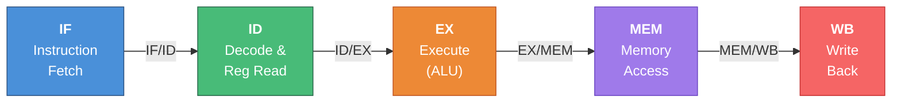
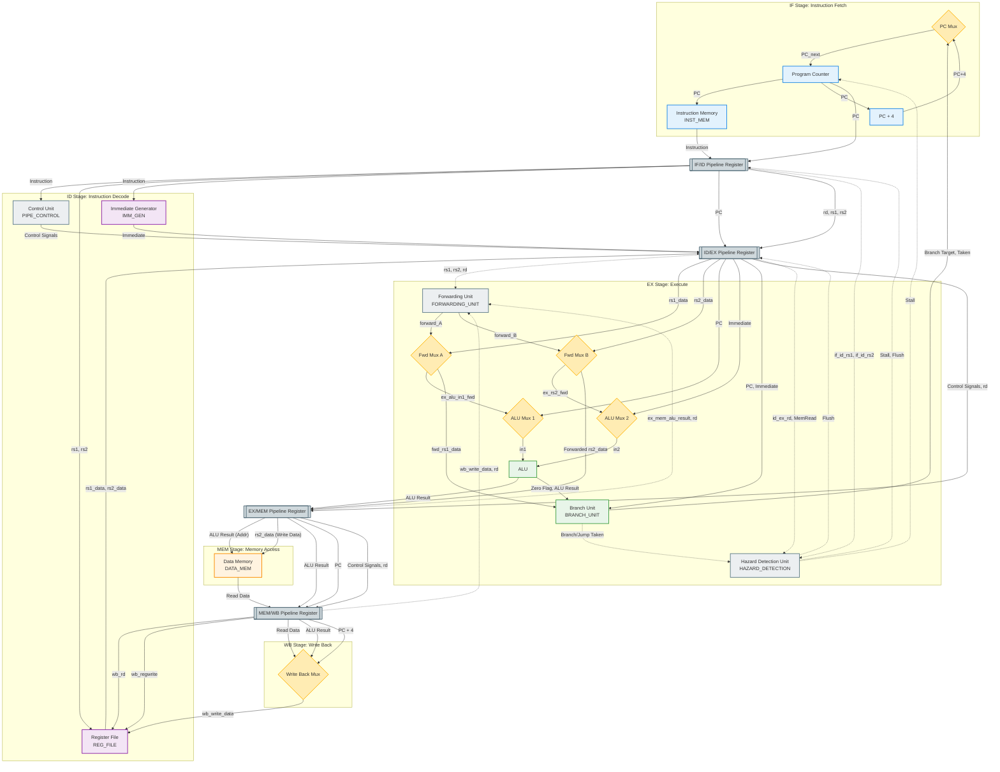
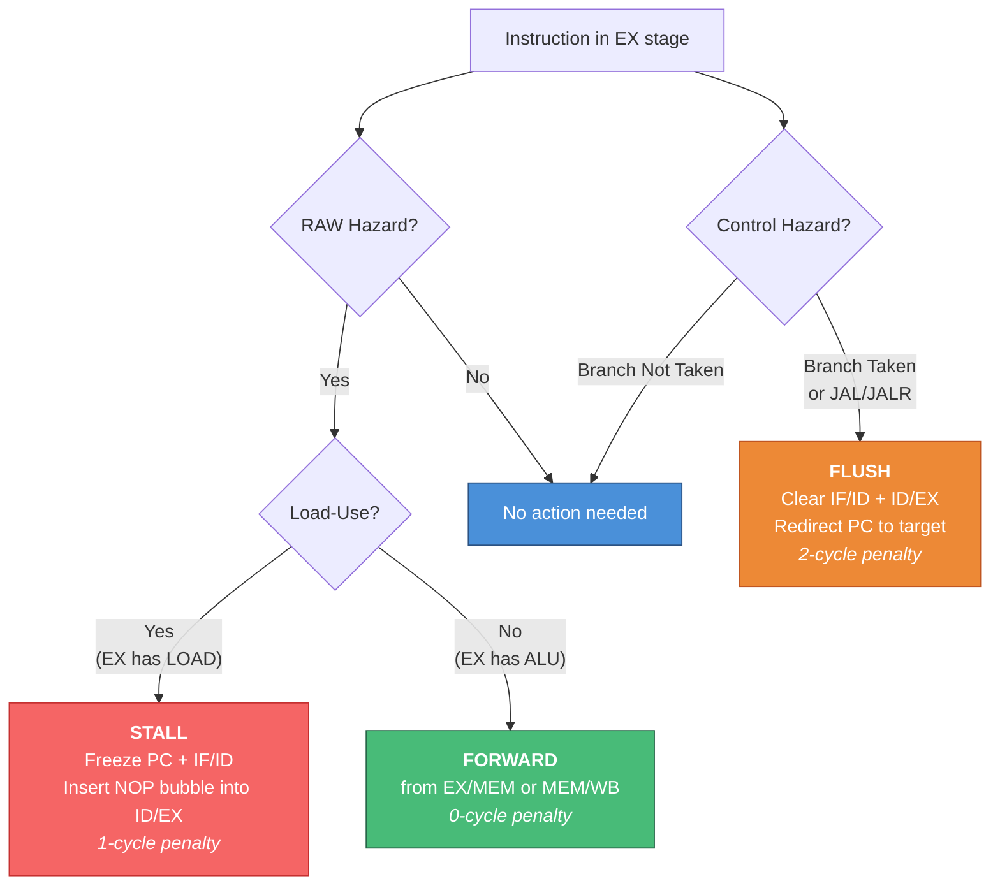
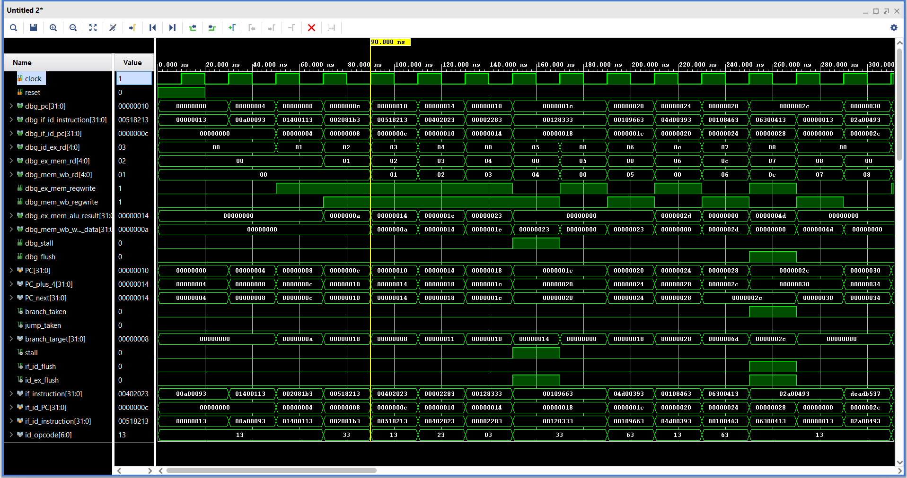
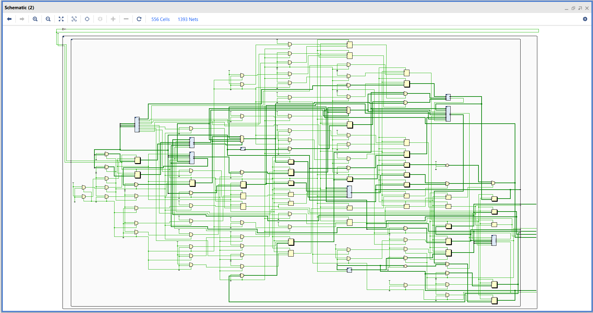
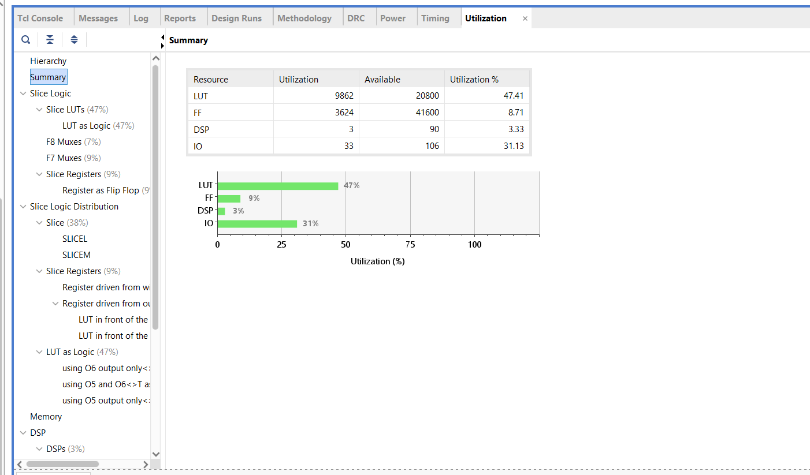
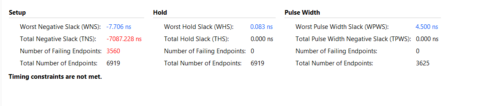
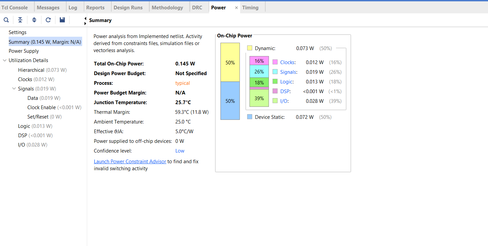

<div align="center">

# ⚙️ RISC-V RV32I Processor — From Single-Cycle to 5-Stage Pipeline


-green?style=for-the-badge)


**A progressive RISC-V processor design series: Single-Cycle → Multi-Cycle → 5-Stage Pipelined**  
*Complete with data forwarding, hazard detection, FPGA implementation on Basys 3, and automated verification*

[Architecture](#-5-stage-pipeline-architecture) · [Instructions](#-supported-rv32i-instructions) · [Hazard Handling](#-hazard-detection--forwarding) · [Modules](#-module-descriptions) · [Simulation](#-simulation) · [FPGA](#-fpga-implementation) · [Verification](#-verification)

</div>

---

## 📋 Project Overview

This repository contains a **complete RISC-V RV32I processor** design series implemented in synthesizable Verilog, progressing through three microarchitectural paradigms:

| Architecture | CPI | Datapath | Memory Model | Hazard Handling |
|:---|:---:|:---|:---|:---|
| **Single-Cycle** | 1 | Combinational | Harvard | N/A (no pipeline) |
| **Multi-Cycle** | 3–5 | FSM-controlled | Von Neumann (shared) | N/A (sequential execution) |
| **5-Stage Pipeline** | ≈1 | Pipelined registers | Harvard | Forwarding + Stalling + Flushing |

The **pipelined processor** (primary focus) implements the full RV32I base integer instruction set with:
- **Data forwarding** from EX/MEM and MEM/WB stages to resolve RAW hazards at zero cost
- **Load-use hazard detection** with automatic 1-cycle stall insertion
- **Branch/jump flushing** with a 2-cycle penalty (predict-not-taken scheme)
- **Write-first register file** for same-cycle WB→ID forwarding
- **FPGA wrapper** targeting the Digilent Basys 3 board (Xilinx Artix-7 xc7a35tcpg236-1)

---

## ✨ Features

- ✅ **37+ RV32I instructions** — R-type, I-type, Load, Store, Branch, Jump, Upper-Immediate
- ✅ **5-stage pipeline** — IF → ID → EX → MEM → WB with 4 pipeline registers
- ✅ **Full data forwarding unit** — EX/MEM and MEM/WB forwarding with priority logic
- ✅ **Hazard detection unit** — Load-use stall + control hazard flush
- ✅ **Branch unit** — Supports all 6 branch conditions (BEQ/BNE/BLT/BGE/BLTU/BGEU) + JAL/JALR
- ✅ **Byte-addressable memories** — 4 KB instruction memory, 256-byte data memory
- ✅ **Sub-word memory access** — LW/LH/LB/LHU/LBU and SW/SH/SB
- ✅ **FPGA-ready** — Basys 3 wrapper with 7-segment hex display, LEDs, and switch-based debug MUX
- ✅ **23 automated test cases** — Covering forwarding, stalls, flushes, branches, loops, shifts, and signed operations
- ✅ **Waveform generation** — VCD output for GTKWave analysis
- ✅ **Makefile build system** — One-command compile, simulate, and waveform viewing

---

## 🏗️ 5-Stage Pipeline Architecture

### Pipeline Stages



| Stage | Function | Key Components |
|:---|:---|:---|
| **IF** (Instruction Fetch) | Fetches instruction from instruction memory using the PC | PC register, PC+4 adder, Instruction Memory, PC MUX |
| **ID** (Instruction Decode) | Decodes opcode, reads registers, generates immediate, produces control signals | Control Unit, Register File (read), Immediate Generator |
| **EX** (Execute) | Performs ALU operations, evaluates branch conditions, computes branch targets | ALU, Branch Unit, Forwarding MUXes, Hazard Detection |
| **MEM** (Memory Access) | Reads from or writes to data memory for load/store instructions | Data Memory (byte-addressable, sub-word access) |
| **WB** (Write-Back) | Writes ALU result, memory data, or PC+4 (for JAL/JALR) back to the register file | Write-back MUX (3-way: ALU / MEM / PC+4) |

### Processor Datapath



---

## 📐 Supported RV32I Instructions

### R-Type (Register-Register)

| Instruction | Operation | ALU Control | Description |
|:---|:---|:---:|:---|
| `ADD` | `rd = rs1 + rs2` | `0010` | Addition |
| `SUB` | `rd = rs1 - rs2` | `0100` | Subtraction |
| `SLL` | `rd = rs1 << rs2[4:0]` | `0011` | Shift left logical |
| `SLT` | `rd = (rs1 < rs2) ? 1 : 0` | `1000` | Set less than (signed) |
| `SLTU` | `rd = (rs1 < rs2) ? 1 : 0` | `1001` | Set less than (unsigned) |
| `XOR` | `rd = rs1 ^ rs2` | `0111` | Bitwise XOR |
| `SRL` | `rd = rs1 >> rs2[4:0]` | `0101` | Shift right logical |
| `SRA` | `rd = rs1 >>> rs2[4:0]` | `1010` | Shift right arithmetic |
| `OR` | `rd = rs1 \| rs2` | `0001` | Bitwise OR |
| `AND` | `rd = rs1 & rs2` | `0000` | Bitwise AND |
| `MUL`* | `rd = rs1 × rs2` | `0110` | Multiplication (M-extension) |

> *\*MUL is from the RISC-V M extension. Included for simulation but not practical for single-cycle synthesis.*

### I-Type (Register-Immediate)

| Instruction | Operation | Description |
|:---|:---|:---|
| `ADDI` | `rd = rs1 + imm` | Add immediate |
| `SLTI` | `rd = (rs1 < imm) ? 1 : 0` | Set less than immediate (signed) |
| `SLTIU` | `rd = (rs1 < imm) ? 1 : 0` | Set less than immediate (unsigned) |
| `XORI` | `rd = rs1 ^ imm` | XOR immediate |
| `ORI` | `rd = rs1 \| imm` | OR immediate |
| `ANDI` | `rd = rs1 & imm` | AND immediate |
| `SLLI` | `rd = rs1 << shamt` | Shift left logical immediate |
| `SRLI` | `rd = rs1 >> shamt` | Shift right logical immediate |
| `SRAI` | `rd = rs1 >>> shamt` | Shift right arithmetic immediate |

### Load Instructions

| Instruction | Width | Sign Extension | Description |
|:---|:---:|:---:|:---|
| `LW` | 32-bit | — | Load word |
| `LH` | 16-bit | Sign-extended | Load halfword |
| `LB` | 8-bit | Sign-extended | Load byte |
| `LHU` | 16-bit | Zero-extended | Load halfword unsigned |
| `LBU` | 8-bit | Zero-extended | Load byte unsigned |

### Store Instructions

| Instruction | Width | Description |
|:---|:---:|:---|
| `SW` | 32-bit | Store word |
| `SH` | 16-bit | Store halfword |
| `SB` | 8-bit | Store byte |

### Branch Instructions

| Instruction | Condition | Description |
|:---|:---|:---|
| `BEQ` | `rs1 == rs2` | Branch if equal |
| `BNE` | `rs1 != rs2` | Branch if not equal |
| `BLT` | `rs1 < rs2` (signed) | Branch if less than |
| `BGE` | `rs1 >= rs2` (signed) | Branch if greater or equal |
| `BLTU` | `rs1 < rs2` (unsigned) | Branch if less than (unsigned) |
| `BGEU` | `rs1 >= rs2` (unsigned) | Branch if greater or equal (unsigned) |

### Jump & Upper-Immediate Instructions

| Instruction | Operation | Description |
|:---|:---|:---|
| `JAL` | `rd = PC+4; PC = PC + imm` | Jump and link |
| `JALR` | `rd = PC+4; PC = (rs1 + imm) & ~1` | Jump and link register (indirect) |
| `LUI` | `rd = imm << 12` | Load upper immediate |
| `AUIPC` | `rd = PC + (imm << 12)` | Add upper immediate to PC |

### Not Implemented

- `FENCE`, `ECALL`, `EBREAK` (system/synchronization instructions)
- CSR instructions (Zicsr extension)
- Exceptions and interrupts
- Atomic instructions (A extension)

---

## 🛡️ Hazard Detection & Forwarding

The pipeline implements a complete hazard resolution scheme. All hazard types are detected and resolved in hardware:



### Hazard Resolution Summary

| Hazard Type | Detection Logic | Resolution Mechanism | Cycle Penalty |
|:---|:---|:---|:---:|
| **RAW Data Hazard** | Forwarding Unit compares `id_ex_rs1/rs2` with `ex_mem_rd` and `mem_wb_rd` | MUX selects EX/MEM or MEM/WB result as ALU input | **0 cycles** |
| **Load-Use Hazard** | Hazard Detection Unit checks `id_ex_mem_read && (id_ex_rd == if_id_rs1 \|\| if_id_rs2)` | Freeze PC, freeze IF/ID, insert NOP bubble into ID/EX | **1 cycle** |
| **Branch Taken** | Branch Unit evaluates condition in EX stage | Flush IF/ID and ID/EX pipeline registers | **2 cycles** |
| **JAL / JALR** | Branch Unit detects `jump` signal | Flush IF/ID and ID/EX pipeline registers | **2 cycles** |
| **WB→ID Same-Cycle** | Register File write-first logic | If read and write address match, forward `write_data` to read port | **0 cycles** |

### Forwarding Unit Encoding

```
forward_A / forward_B:
  2'b00 → No forwarding (use ID/EX register value)
  2'b10 → Forward from EX/MEM (result from 1 instruction ago)  ← Higher priority
  2'b01 → Forward from MEM/WB (result from 2 instructions ago)
```

### Priority Rules
1. **Control hazards override data hazards** — If a branch is taken during the same cycle as a load-use stall, the branch takes priority (flush wins over stall)
2. **EX/MEM forwarding overrides MEM/WB forwarding** — More recent results take priority when both match
3. **x0 is never forwarded** — Both units check `rd != 5'b0` before activating

---

## 📦 Module Descriptions

### Pipeline Core Modules

| Module | File | Lines | Description |
|:---|:---|:---:|:---|
| **PIPE_PROCESSOR** | `PIPE_PROCESSOR.v` | 54 | Top-level wrapper; instantiates the pipeline datapath with debug outputs |
| **PIPE_DATAPATH** | `PIPE_DATAPATH.v` | 474 | Central pipeline module: contains all 4 pipeline registers (IF/ID, ID/EX, EX/MEM, MEM/WB), stage interconnections, PC logic, forwarding MUXes, and write-back MUX |
| **PIPE_CONTROL** | `PIPE_CONTROL.v` | 152 | Combinational control signal generator; decodes opcode/funct3/funct7 into ALU control, memory, branch, and register write signals |
| **ALU** | `ALU.v` | 54 | 12-operation ALU with zero flag (AND, OR, ADD, SUB, SLL, SRL, SRA, XOR, SLT, SLTU, MUL, Pass-B for LUI) |
| **REG_FILE** | `REG_FILE.v` | 52 | 32×32-bit register file with write-first forwarding; x0 hardwired to zero |
| **INST_MEM** | `INST_MEM.v` | 181 | 4 KB byte-addressable instruction memory; NOP-initialized to prevent x-propagation; contains 24-instruction test program |
| **DATA_MEM** | `DATA_MEM.v` | 68 | 256-byte byte-addressable data memory; supports LW/LH/LB/LHU/LBU and SW/SH/SB |
| **IMM_GEN** | `IMM_GEN.v` | 46 | Immediate generator for all RISC-V formats: I, S, B, U, J with sign extension |
| **BRANCH_UNIT** | `BRANCH_UNIT.v` | 56 | Evaluates all 6 branch conditions + JAL/JALR; computes branch target (PC+imm or (rs1+imm)&~1 for JALR) |
| **FORWARDING_UNIT** | `FORWARDING_UNIT.v` | 66 | Resolves RAW hazards by selecting forwarding paths from EX/MEM and MEM/WB stages |
| **HAZARD_DETECTION** | `HAZARD_DETECTION.v` | 62 | Detects load-use hazards (stall) and control hazards (flush); priority: control > data |

### FPGA Module

| Module | File | Lines | Description |
|:---|:---|:---:|:---|
| **PIPE_PROCESSOR_FPGA** | `PIPE_PROCESSOR_FPGA.v` | 181 | Basys 3 FPGA top-level wrapper; 4-digit seven-segment hex display driver, 16 LEDs for debug data, switch-based debug MUX (PC / Instruction / ALU Result / Write-back), stall/flush indicator LEDs |

---

## 📁 Directory Structure

```
.
├── Pipeline/                          # ⭐ 5-Stage Pipelined Processor (primary)
│   ├── ALU.v                         #   12-operation ALU with zero flag
│   ├── BRANCH_UNIT.v                 #   Branch condition evaluation + target calc
│   ├── DATA_MEM.v                    #   256-byte data memory (LW/LH/LB/SW/SH/SB)
│   ├── FORWARDING_UNIT.v            #   EX/MEM and MEM/WB data forwarding
│   ├── HAZARD_DETECTION.v           #   Load-use stall + branch/jump flush
│   ├── IMM_GEN.v                    #   Immediate generator (I/S/B/U/J formats)
│   ├── INST_MEM.v                   #   4 KB instruction memory (NOP-initialized)
│   ├── PIPE_CONTROL.v               #   Control signal generator (ID stage)
│   ├── PIPE_DATAPATH.v              #   Pipeline registers + stage interconnect
│   ├── PIPE_PROCESSOR.v             #   Top-level module (simulation)
│   ├── PIPE_PROCESSOR_FPGA.v        #   Top-level module (Basys 3 FPGA)
│   ├── PIPE_Processor_tb.v          #   Automated testbench (23 tests)
│   ├── REG_FILE.v                   #   32x32 register file (write-first)
│   ├── Makefile                     #   Build automation (iverilog + vvp)
│   ├── basys3.xdc                   #   Basys 3 XDC constraints (46 pins)
│   └── docs/                        #   Screenshots and documentation images
│       ├── vivado_schematic.png      #   Synthesized schematic (556 cells)
│       ├── gtkwave_waveform.png      #   GTKWave simulation waveform
│       ├── vivado_fpga_schematic.png #   FPGA wrapper schematic (62 cells)
│       ├── vivado_design_runs.png    #   Vivado synthesis/implementation results
│       ├── vivado_implementation_runs.png
│       ├── vivado_timing_report.png  #   Timing analysis summary
│       ├── vivado_clock_report.png   #   Clock constraint report
│       ├── vivado_power_report.png   #   Power analysis (0.145 W)
│       └── vivado_utilization_report.png  # Resource utilization
│
├── Single-cycle/                      # Single-Cycle Processor
│   ├── PROCESSOR.v                   #   Top-level (1 CPI, combinational datapath)
│   ├── IFU.v                        #   Instruction Fetch Unit (PC + memory)
│   ├── CONTROL.v                    #   Combinational control unit
│   ├── DATAPATH.v                   #   ALU + RegFile + Memory interconnect
│   ├── ALU.v, REG_FILE.v            #   Shared functional units
│   ├── IMM_GEN.v, INST_MEM.v        #   Shared modules
│   ├── BRANCH_UNIT.v, DATA_MEM.v    #   Branch + memory
│   └── Processor_tb.v               #   Testbench with verification
│
├── MultiCycle/                        # Multi-Cycle Processor
│   ├── MC_PROCESSOR.v               #   Top-level (3-5 CPI, FSM-controlled)
│   ├── MC_CONTROL.v                 #   FSM control unit (5 states)
│   ├── MC_DATAPATH.v                #   Datapath with intermediate registers
│   ├── MEMORY.v                     #   Shared Von Neumann memory
│   ├── ALU.v, REG_FILE.v, IMM_GEN.v #   Reused functional units
│   └── MC_Processor_tb.v            #   Testbench
│
└── Roadmap/                           # Learning roadmap documentation
    ├── riscv_processor_roadmap_part1.md
    ├── riscv_processor_roadmap_part2.md
    └── riscv_processor_roadmap_part3.md
```

---

## 🔧 Simulation

### Prerequisites

- [Icarus Verilog](http://iverilog.icarus.com/) (`iverilog` and `vvp`)
- [GTKWave](http://gtkwave.sourceforge.net/) (optional, for waveform viewing)

### Quick Start

```bash
cd Pipeline/

# Compile and simulate (using Make)
make simulate

# Or manually
iverilog -o PIPE_Processor_tb.exe PIPE_Processor_tb.v
vvp PIPE_Processor_tb.exe

# View waveforms
gtkwave pipe_output_wave.vcd
```

### Makefile Targets

| Target | Command | Description |
|:---|:---|:---|
| `make simulate` | `iverilog` + `vvp` | Compile and run simulation |
| `make compile` | `iverilog` | Compile only |
| `make wave` | `gtkwave` | Simulate + open waveform viewer |
| `make clean` | `rm -f` | Remove build artifacts (`.exe`, `.vcd`) |

### Expected Output

```
==========================================================================
  5-Stage Pipelined RISC-V Processor — Simulation Started
==========================================================================

Cycle |   PC   | IF/ID Instr | Stall | Flush | EX/MEM rd | MEM/WB rd | WB Data
------|--------|------------|-------|-------|-----------|-----------|----------
   1  | 0004   | 00a00093   |   0   |   0   |    x00    |    x00    | 00000000
   2  | 0008   | 01400113   |   0   |   0   |    x01    |    x00    | 00000000
  ...
  80  | 0110   | 00000013   |   0   |   0   |    x00    |    x00    | 00000000

==========================================================================
  Automated Verification
==========================================================================
  [PASS] x1  = 0x0000000a (expected 0x0000000A) — ADDI basic
  [PASS] x2  = 0x00000014 (expected 0x00000014) — ADDI basic
  [PASS] x3  = 0x0000001e (expected 0x0000001E) — ADD + RAW forwarding
  ...
  [PASS] x26 = 0x000000b2 (expected 0x000000B2) — XORI

==========================================================================
  ✅ ALL 23 TESTS PASSED! Pipeline processor working correctly.
  Total Cycles: 80 | Final PC: 0x00000110
==========================================================================
```

### Simulation Waveform (GTKWave)

<p align="center">
  
  <br/>
  <em>Per-cycle pipeline signals: PC, instruction, pipeline register flow, stall/flush, branch_taken, forwarding activity</em>
</p>

---

## 🔌 FPGA Implementation

### Target Board

| Parameter | Value |
|:---|:---|
| **Board** | Digilent Basys 3 |
| **FPGA** | Xilinx Artix-7 XC7A35TCPG236-1 |
| **Clock** | 100 MHz on-board oscillator (Pin W5) |
| **I/O Standard** | LVCMOS33 (3.3 V) |
| **Constraints** | `basys3.xdc` (46 active pins) |

### FPGA Debug Interface

The `PIPE_PROCESSOR_FPGA` wrapper exposes internal pipeline state to Basys 3 peripherals:

| Peripheral | Function |
|:---|:---|
| **16 LEDs** | LED[13:0] = selected 14-bit debug data; LED[14] = flush indicator; LED[15] = stall indicator |
| **16 Switches** | SW[1:0] = debug word select; SW[2] = upper/lower 16-bit half |
| **4-Digit 7-Seg** | Hex display of selected 16-bit debug value (763 Hz refresh) |
| **Center Button** | Active-high asynchronous reset |

**Debug MUX (SW[1:0]):**

| SW[1:0] | Debug Word | Description |
|:---:|:---|:---|
| `00` | PC | Current program counter |
| `01` | Instruction | IF/ID instruction register |
| `10` | ALU Result | EX/MEM ALU output |
| `11` | Write-Back | MEM/WB write-back data |

### Vivado Synthesis Steps

```tcl
# 1. Create project targeting xc7a35tcpg236-1
# 2. Add all .v source files from Pipeline/
# 3. Set PIPE_PROCESSOR_FPGA as top module
# 4. Add basys3.xdc as constraints
# 5. Run Synthesis → Implementation → Generate Bitstream
# 6. Program the Basys 3 via USB-JTAG
```

### Synthesis Results

<p align="center">
  
  <br/>
  <em>Post-synthesis schematic of the full pipelined processor (556 cells, 1393 nets)</em>
</p>

### FPGA Resource Utilization (Artix-7 XC7A35T)

| Resource | Used | Available | Utilization |
|:---|:---:|:---:|:---:|
| **LUT** | 9,862 | 20,800 | 47.41% |
| **FF** (Flip-Flops) | 3,624 | 41,600 | 8.71% |
| **DSP** | 3 | 90 | 3.33% |
| **IO** | 33 | 106 | 31.13% |
| **BRAM** | 0 | — | — |
| **URAM** | 0 | — | — |

<p align="center">
  
  <br/>
  <em>Resource utilization breakdown — Slice LUTs (47%), FFs (9%), DSPs (3%), I/O (31%)</em>
</p>

### Timing Analysis

| Metric | Value |
|:---|:---|
| **Target Clock** | 100 MHz (10.00 ns period) |
| **WNS** (Worst Negative Slack) | -7.706 ns |
| **TNS** (Total Negative Slack) | -7087.228 ns |
| **WHS** (Worst Hold Slack) | 0.083 ns (met ✅) |
| **Status** | ⚠️ Setup timing not met at 100 MHz |

> **Note:** The design currently fails setup timing at 100 MHz. This is expected for an educational processor without optimization. The design is functionally correct and can run at a reduced clock frequency (~40 MHz) or with the addition of a clock divider. See [Future Improvements](#-future-improvements).

<p align="center">
  
  <br/>
  <em>Timing summary — Hold constraints met, setup constraints require clock frequency reduction</em>
</p>

### Power Analysis

| Parameter | Value |
|:---|:---|
| **Total On-Chip Power** | 0.145 W |
| **Dynamic Power** | 0.073 W (50%) |
| **Device Static** | 0.072 W (50%) |
| **Junction Temperature** | 25.7°C |
| **Thermal Margin** | 59.3°C (11.8 W) |

<p align="center">
  
  <br/>
  <em>Power distribution — Clocks (16%), Signals (26%), Logic (18%), DSP (<1%), I/O (39%)</em>
</p>

---

## ✅ Verification

### Test Program

The instruction memory (`INST_MEM.v`) contains a 24-instruction test program that exercises all pipeline hazard scenarios:

```
PC     | Instruction          | Purpose
-------|----------------------|------------------------------------------
0x00   | ADDI x1, x0, 10     | Basic ALU — load constant
0x04   | ADDI x2, x0, 20     | Basic ALU — load constant
0x08   | ADD  x3, x1, x2     | RAW hazard → EX/MEM + MEM/WB forwarding
0x0C   | ADDI x4, x3, 5      | RAW hazard → EX/MEM forwarding
0x10   | SW   x4, 0(x0)      | Store to memory
0x14   | LW   x5, 0(x0)      | Load from memory
0x18   | ADD  x6, x5, x1     | Load-use hazard → 1-cycle stall
0x1C   | BNE  x1, x1, 12     | Branch NOT taken
0x20   | ADDI x7, x0, 77     | Executes (not flushed)
0x24   | BEQ  x1, x1, 8      | Branch TAKEN → flush next 2 instrs
0x28   | ADDI x8, x0, 99     | SKIPPED (flushed)
0x2C   | ADDI x9, x0, 42     | Branch target
0x30   | LUI  x10, 0xDEADB   | Upper immediate
0x34   | AUIPC x11, 0x1      | PC-relative upper immediate
0x38   | JAL  x12, 8          | Jump → flush + link register
0x3C   | ADDI x13, x0, 88    | SKIPPED (flushed by JAL)
0x40   | SUB  x14, x6, x1    | Subtraction
0x44   | SLT  x15, x1, x2    | Signed comparison
0x48   | ANDI x16, x7, 0xFF  | AND immediate
0x4C   | ORI  x17, x0, 0x0F  | OR immediate
0x50   | SLLI x18, x1, 3     | Shift left immediate
0x54–58| SRL  x20, x18, x19  | Shift right logical (register)
0x5C–64| SRAI x22, x21, 4    | Arithmetic right shift (signed, negative value)
0x68–6C| JALR x24, x23, 0    | Indirect jump + link + flush
0x74–7C| Backward BNE loop   | 3-iteration backward branch (x25: 3→2→1→0)
0x80   | XORI x26, x7, 0xFF  | XOR immediate
```

### Automated Test Results (23/23 PASS)

| # | Test | Expected | Category | Status |
|:---:|:---|:---|:---|:---:|
| 1 | `ADDI x1, x0, 10` → x1 = 0x0A | `0x0000000A` | ALU | ✅ |
| 2 | `ADDI x2, x0, 20` → x2 = 0x14 | `0x00000014` | ALU | ✅ |
| 3 | `ADD x3, x1, x2` → x3 = 30 | `0x0000001E` | RAW Forwarding | ✅ |
| 4 | `ADDI x4, x3, 5` → x4 = 35 | `0x00000023` | EX/MEM Forwarding | ✅ |
| 5 | `LW x5, 0(x0)` → x5 = 35 | `0x00000023` | Memory (SW+LW) | ✅ |
| 6 | `ADD x6, x5, x1` → x6 = 45 | `0x0000002D` | Load-Use Stall | ✅ |
| 7 | `ADDI x7, x0, 77` executes | `0x0000004D` | Branch Not-Taken | ✅ |
| 8 | x8 ≠ 99 (BEQ flushed it) | `≠ 0x00000063` | Branch Flush | ✅ |
| 9 | `ADDI x9, x0, 42` → x9 = 42 | `0x0000002A` | Branch Target | ✅ |
| 10 | `LUI x10, 0xDEADB` | `0xDEADB000` | LUI | ✅ |
| 11 | `AUIPC x11, 0x1` at PC=0x34 | `0x00001034` | AUIPC | ✅ |
| 12 | `JAL x12, 8` at PC=0x38 | `0x0000003C` | JAL Link | ✅ |
| 13 | x13 ≠ 88 (JAL flushed it) | `≠ 0x00000058` | JAL Flush | ✅ |
| 14 | `SUB x14, x6, x1` → 45-10 | `0x00000023` | SUB | ✅ |
| 15 | `SLT x15, x1, x2` → (10<20) | `0x00000001` | SLT | ✅ |
| 16 | `ANDI x16, x7, 0xFF` | `0x0000004D` | ANDI | ✅ |
| 17 | `ORI x17, x0, 0x0F` | `0x0000000F` | ORI | ✅ |
| 18 | `SLLI x18, x1, 3` → 10<<3 | `0x00000050` | Shift Left | ✅ |
| 19 | `SRL x20, x18, x19` → 80>>2 | `0x00000014` | Shift Right Logical | ✅ |
| 20 | `SRAI x22, x21, 4` (signed) | `0xFFFFFEFF` | Shift Right Arith. | ✅ |
| 21 | `JALR x24, x23, 0` at PC=0x6C | `0x00000070` | JALR Link | ✅ |
| 22 | Loop (x25: 3→0) | `0x00000000` | Backward Branch | ✅ |
| 23 | `XORI x26, x7, 0xFF` | `0x000000B2` | XORI | ✅ |

---

## 🏗️ Design Decisions

| Decision | Rationale |
|:---|:---|
| **Branch prediction: always not-taken** | Simplest scheme; taken branches incur a 2-cycle flush penalty. A BTB or tournament predictor would reduce this. |
| **Harvard architecture** | Separate instruction and data memories avoid structural hazards and simplify the pipeline design. |
| **Branch resolution in EX stage** | Standard for educational 5-stage pipelines. Moving resolution to ID would reduce penalty to 1 cycle but adds complexity. |
| **Forwarding granularity** | Forwarding covers all ALU→ALU and ALU→branch RAW hazards. Load-use requires a 1-cycle stall since data is only available after MEM. |
| **No store-load forwarding** | A store followed immediately by a load to the same address will NOT forward from the store buffer. An intervening instruction must separate them. |
| **Asynchronous reset** | All pipeline registers use active-high asynchronous reset (`posedge clock or posedge reset`). |
| **NOP-initialized instruction memory** | All unused instruction memory locations are pre-filled with `0x00000013` (NOP = `ADDI x0, x0, 0`) to prevent `x`-propagation in simulation. |
| **Write-first register file** | When WB writes to a register that ID reads in the same cycle, the new value is forwarded. This eliminates an additional hazard case. |

---

## 🔮 Future Improvements

- [ ] **Clock divider / PLL** — Add a clock divider or use a Clocking Wizard IP to bring the operating frequency within timing closure (≤40 MHz for the current design)
- [ ] **Branch prediction** — Implement a 2-bit saturating counter or Branch Target Buffer (BTB) to reduce branch penalty
- [ ] **Early branch resolution** — Move branch condition evaluation from EX to ID stage to reduce penalty from 2 to 1 cycle
- [ ] **Cache hierarchy** — Replace fixed instruction/data memories with instruction and data caches
- [ ] **M extension** — Replace the single-cycle multiplier with a pipelined or iterative multiplier for synthesis
- [ ] **CSR support** — Add Control and Status Registers for interrupt handling and system calls
- [ ] **Exception handling** — Implement trap mechanism for illegal instructions, misaligned access
- [ ] **Store-load forwarding** — Add a store buffer with forwarding logic
- [ ] **Pipeline flushing optimization** — Use delayed branching or speculative execution
- [ ] **Multi-core** — Extend to a dual-core design with shared memory and coherence protocol
- [ ] **UART interface** — Add a UART module for PC-to-FPGA communication and program loading

---

## 📚 Learning Outcomes

This project demonstrates proficiency in:

- **Digital design fundamentals** — Sequential and combinational logic, FSMs, MUXing, register files
- **Computer architecture** — Pipeline stages, hazard taxonomy (structural, data, control), forwarding networks
- **RISC-V ISA** — RV32I encoding formats (R/I/S/B/U/J), instruction decoding, immediate extraction
- **RTL design** — Synthesizable Verilog, include guards, parameterized modules, hierarchical design
- **Verification methodology** — Automated testbenches with pass/fail assertions, VCD waveform analysis, regression testing
- **FPGA implementation** — Vivado synthesis flow, XDC constraints, resource utilization analysis, timing closure
- **Hardware debugging** — Debug MUX design, LED/7-segment output, pipeline state visibility on FPGA

---

## 📊 Architecture Comparison

| Metric | Single-Cycle | Multi-Cycle | Pipelined |
|:---|:---:|:---:|:---:|
| **CPI** | 1 | 3–5 | ≈1 (with stalls) |
| **Clock Period** | Long (limited by critical path) | Short (broken into stages) | Short (pipelined) |
| **Memory Model** | Harvard | Von Neumann (shared) | Harvard |
| **Hardware Cost** | Low | Medium (FSM + temp regs) | High (pipeline regs + forwarding + hazard unit) |
| **Throughput** | Low | Low | High |
| **Control** | Combinational | FSM (5 states) | Combinational + pipeline regs |
| **Hazard Handling** | N/A | N/A | Forwarding + Stall + Flush |

---

## 📝 Related Projects in This Repository

| Architecture | Directory | Description |
|:---|:---|:---|
| **Single-Cycle** | `Single-cycle/` | 1 CPI, purely combinational datapath, Harvard architecture |
| **Multi-Cycle** | `MultiCycle/` | 3–5 CPI, FSM-controlled Von Neumann architecture |
| **5-Stage Pipeline** | `Pipeline/` | ≈1 CPI with full hazard resolution (this README's focus) |
| **Roadmap** | `Roadmap/` | Three-part learning roadmap for building RISC-V processors |

---

## 📜 License

This project is released under the **MIT License**. See [LICENSE](LICENSE) for details.

This project is intended for educational purposes — learning RISC-V ISA, computer architecture, and digital design.

---

<div align="center">

**Built with ❤️ for learning RISC-V and computer architecture**

*If you found this project helpful, please consider giving it a ⭐!*

</div>

