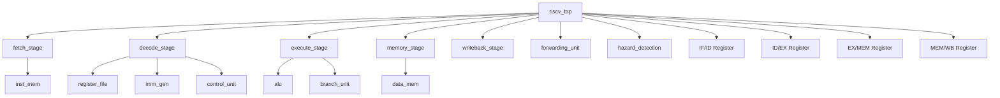

# RISC-V Processor Implementation Roadmap — Part 2

> Continuation from [Part 1](file:///C:/Users/ayush/.gemini/antigravity/brain/6eb511e4-b7bd-4c46-a258-9b862f0b6238/artifacts/riscv_processor_roadmap_part1.md)

---

## Phase 5: Verilog/SystemVerilog Implementation Guidance

### 5.1 Recommended Folder Structure (Industry-Standard)

```
riscv_processor/
├── rtl/                          # All synthesizable RTL
│   ├── core/
│   │   ├── riscv_top.v           # Top-level processor
│   │   ├── fetch_stage.v         # IF stage
│   │   ├── decode_stage.v        # ID stage
│   │   ├── execute_stage.v       # EX stage
│   │   ├── memory_stage.v        # MEM stage
│   │   ├── writeback_stage.v     # WB stage
│   │   ├── alu.v
│   │   ├── control_unit.v
│   │   ├── register_file.v
│   │   ├── imm_gen.v
│   │   └── branch_unit.v
│   ├── pipeline/
│   │   ├── if_id_reg.v
│   │   ├── id_ex_reg.v
│   │   ├── ex_mem_reg.v
│   │   └── mem_wb_reg.v
│   ├── hazard/
│   │   ├── forwarding_unit.v
│   │   ├── hazard_detection.v
│   │   └── branch_predictor.v
│   ├── memory/
│   │   ├── inst_mem.v
│   │   ├── data_mem.v
│   │   └── cache.v               # Future
│   └── include/
│       └── riscv_defs.vh         # Parameters, `define constants
├── tb/                           # Testbenches
│   ├── tb_riscv_top.v
│   ├── tb_alu.v
│   └── test_programs/
│       ├── add_test.hex
│       ├── branch_test.hex
│       └── hazard_test.hex
├── sim/                          # Simulation scripts
│   ├── Makefile
│   ├── run_sim.sh
│   └── filelist.f
├── synth/                        # Synthesis files
│   ├── constraints.xdc
│   └── synth_script.tcl
├── doc/                          # Documentation
│   ├── architecture.md
│   ├── microarchitecture.md
│   └── images/
└── README.md
```

> [!IMPORTANT]
> **Your current structure** duplicates files across folders (ALU.v exists in both `ALU/` and `Processor/`). Restructure to a single `rtl/` source. Use a filelist or Makefile to compile.

### 5.2 Module Hierarchy



### 5.3 Industry Coding Style

**Use a header file for all constants (Verilog `include` approach):**
```verilog
// riscv_defs.vh — include in every module with `include "riscv_defs.vh"

// Widths
`define DATA_WIDTH    32
`define ADDR_WIDTH    32
`define REG_ADDR_W    5
`define NUM_REGS      32

// Opcodes
`define OP_R_TYPE     7'b0110011
`define OP_I_TYPE     7'b0010011
`define OP_LOAD       7'b0000011
`define OP_STORE      7'b0100011
`define OP_BRANCH     7'b1100011
`define OP_JAL        7'b1101111
`define OP_JALR       7'b1100111
`define OP_LUI        7'b0110111
`define OP_AUIPC      7'b0010111

// ALU operations
`define ALU_AND       4'b0000
`define ALU_OR        4'b0001
`define ALU_ADD       4'b0010
`define ALU_SLL       4'b0011
`define ALU_SUB       4'b0100
`define ALU_SRL       4'b0101
`define ALU_MUL       4'b0110
`define ALU_XOR       4'b0111
`define ALU_SLT       4'b1000
`define ALU_SLTU      4'b1001
`define ALU_SRA       4'b1010
`define ALU_PASSB     4'b1011
`define ALU_PCIA      4'b1100
```

**Alternative: Use `localparam` inside modules (no global namespace pollution):**
```verilog
module CONTROL (
    input  [6:0] opcode,
    // ...
);
    // Use localparam for constants scoped to this module
    localparam R_TYPE  = 7'b0110011;
    localparam I_TYPE  = 7'b0010011;
    localparam LOAD    = 7'b0000011;
    // ... (this is what your current CONTROL.v already does — good!)
endmodule
```

**Named port connections (ALWAYS use in industry):**
```verilog
// ❌ BAD — Positional (your current style in PROCESSOR.v)
IFU ifu_module(clock, reset, branch_taken, jump, branch_target, instruction_code, PC);

// ✅ GOOD — Named ports (industry standard)
IFU ifu_module (
    .clk            (clock),
    .rst_n          (reset),
    .branch_taken   (branch_taken),
    .jump           (jump),
    .branch_target  (branch_target),
    .instruction    (instruction_code),
    .pc_out         (PC)
);
```

### 5.4 Synthesizable Coding Practices (Verilog)

| Practice | Rule |
|----------|------|
| Sequential logic | `always @(posedge clk or negedge rst_n)` |
| Combinational logic | `always @(*)` — NEVER forget signals in sensitivity list |
| No latches | Assign ALL outputs in ALL branches of `always @(*)` |
| Reset | Use async active-low reset (`rst_n`) — industry standard |
| Clock | Single clock domain; name it `clk` |
| No initial blocks | Not synthesizable (use only in testbenches) |
| No delays (#) | Not synthesizable (simulation only) |
| Signal types | `wire` for continuous assignments, `reg` for `always` block outputs |
| Bit widths | Always explicit — avoid bare `integer` in RTL |
| Case statements | Always have `default` clause |
| Blocking `=` | Use ONLY in `always @(*)` (combinational) |
| Non-blocking `<=` | Use ONLY in `always @(posedge clk)` (sequential) |

### 5.5 Common RTL Mistakes

```
1. Missing sensitivity list → Use always @(*) with star wildcard
2. Incomplete case/if-else → Creates latches
3. Mixing blocking/non-blocking → Never mix in same always block
4. Multiple drivers → wire driven by two always blocks
5. Signed/unsigned mismatch → Causes simulation bugs
6. Clock gating without ICG → Causes glitches
7. Reset not registered → Metastability risk
8. Using === instead of == → === is non-synthesizable (x/z aware)
9. Using integer instead of reg [N:0] → integer is 32-bit, not parameterizable
10. Forgetting to initialize reg in always @(*) defaults → Latch
```

---

## Phase 6: Verification Roadmap

### 6.1 Testbench Architecture

```
┌──────────────────────────────────────────┐
│              TOP TESTBENCH               │
│  ┌────────────────────────────────────┐  │
│  │         Test Stimulus              │  │
│  │  (Assembly program loaded via hex) │  │
│  └──────────────┬─────────────────────┘  │
│                 │                         │
│  ┌──────────────▼─────────────────────┐  │
│  │        DUT (riscv_top)             │  │
│  └──────────────┬─────────────────────┘  │
│                 │                         │
│  ┌──────────────▼─────────────────────┐  │
│  │      Self-Checking Logic           │  │
│  │  (Compare reg values vs expected)  │  │
│  └──────────────┬─────────────────────┘  │
│                 │                         │
│  ┌──────────────▼─────────────────────┐  │
│  │     Scoreboard / Report            │  │
│  │  (PASS/FAIL count, coverage)       │  │
│  └────────────────────────────────────┘  │
└──────────────────────────────────────────┘
```

### 6.2 Self-Checking Testbench Template

```verilog
module tb_riscv_top;
    reg clk, rst_n;
    integer pass_count, fail_count;

    // DUT instantiation
    riscv_top dut (.clk(clk), .rst_n(rst_n));

    // Clock generation
    initial clk = 0;
    always #5 clk = ~clk; // 100MHz

    // Load test program
    initial $readmemh("test_programs/add_test.hex", dut.inst_mem.memory);

    // Task: check register value
    task check_reg;
        input [4:0] reg_addr;
        input [31:0] expected;
        begin
            if (dut.reg_file.registers[reg_addr] === expected) begin
                $display("PASS: x%0d = 0x%08h", reg_addr, expected);
                pass_count = pass_count + 1;
            end else begin
                $display("FAIL: x%0d = 0x%08h, expected 0x%08h", 
                         reg_addr, dut.reg_file.registers[reg_addr], expected);
                fail_count = fail_count + 1;
            end
        end
    endtask

    initial begin
        pass_count = 0; fail_count = 0;
        rst_n = 0;
        #20 rst_n = 1;
        
        // Wait for program to complete
        repeat(100) @(posedge clk);
        
        // Check results
        check_reg(5'd1, 32'd10);    // x1 should be 10
        check_reg(5'd2, 32'd20);    // x2 should be 20
        check_reg(5'd3, 32'd30);    // x3 = x1 + x2 = 30
        
        // Summary
        $display("\n=== TEST SUMMARY ===");
        $display("PASSED: %0d", pass_count);
        $display("FAILED: %0d", fail_count);
        if (fail_count == 0) $display("ALL TESTS PASSED!");
        
        $finish;
    end

    // Waveform dump
    initial begin
        $dumpfile("wave.vcd");
        $dumpvars(0, tb_riscv_top);
    end
endmodule
```

### 6.3 Testing Strategy (Progressive)

| Level | What | How | Tools |
|-------|------|-----|-------|
| **Unit** | Each module independently | Directed stimulus | Icarus/ModelSim |
| **Integration** | Connected stages | Small programs | Icarus/Verilator |
| **Compliance** | RISC-V official tests | `riscv-tests` suite | Verilator |
| **Random** | Random instruction sequences | Constrained random gen | SystemVerilog |
| **Regression** | All tests automated | Makefile + CI | GitHub Actions |

### 6.4 Inline Verification Checks (Verilog-Compatible)

Since pure Verilog doesn't have SVA assertions, use `if` checks in your testbench:

```verilog
// In your testbench — verify no X/Z outputs after reset
always @(posedge clk) begin
    if (rst_n && (^dut.alu_result === 1'bx)) begin
        $display("ERROR @ %0t: ALU output contains X/Z", $time);
        $finish;
    end
end

// Verify x0 is always zero
always @(posedge clk) begin
    if (dut.reg_file.registers[0] !== 32'd0) begin
        $display("ERROR @ %0t: x0 is not zero! Value: 0x%08h", 
                 $time, dut.reg_file.registers[0]);
        $finish;
    end
end

// Verify PC doesn't change during stall
reg [31:0] prev_pc;
always @(posedge clk) begin
    prev_pc <= dut.pc;
    if (rst_n && dut.stall && (dut.pc !== prev_pc)) begin
        $display("ERROR @ %0t: PC changed during stall!", $time);
    end
end
```

> [!TIP]
> These `if`-based checks work in any Verilog simulator. When you learn SystemVerilog later for verification roles, you can convert these to formal SVA assertions — but for RTL design interviews, this approach is perfectly sufficient.

### 6.5 Functional Coverage (Testbench-Based Tracking)

In pure Verilog, track coverage manually with counters:

```verilog
// Coverage tracking in testbench
integer r_type_count, i_type_count, load_count, store_count;
integer branch_taken_count, branch_not_taken_count;
integer fwd_ex_count, fwd_mem_count;

always @(posedge clk) begin
    if (rst_n) begin
        case (dut.instruction[6:0])
            7'b0110011: r_type_count = r_type_count + 1;
            7'b0010011: i_type_count = i_type_count + 1;
            7'b0000011: load_count   = load_count + 1;
            7'b0100011: store_count  = store_count + 1;
        endcase
        
        if (dut.branch_taken)
            branch_taken_count = branch_taken_count + 1;
    end
end

// Print coverage summary at end
initial begin
    // ... (after simulation ends)
    $display("=== COVERAGE SUMMARY ===");
    $display("R-type: %0d, I-type: %0d, Load: %0d, Store: %0d",
             r_type_count, i_type_count, load_count, store_count);
    $display("Branches taken: %0d, not-taken: %0d",
             branch_taken_count, branch_not_taken_count);
end
```

> [!NOTE]
> This manual coverage approach is fine for an RTL design project. Formal `covergroup` syntax requires SystemVerilog — you'll learn that when/if you pursue verification (DV) roles.

### 6.6 Tools for Verification

| Tool | Free? | Best For |
|------|-------|----------|
| **Icarus Verilog** | ✅ | Quick simulation, learning |
| **Verilator** | ✅ | Fast cycle-accurate sim, lint checking |
| **GTKWave** | ✅ | Waveform viewing |
| **ModelSim (Intel Ed.)** | ✅ | Industry-standard, SV support |
| **Vivado Simulator** | ✅ | If targeting Xilinx FPGA |
| **Synopsys VCS** | ❌ | Industry gold standard (university may have) |

---

## Phase 7: FPGA Implementation

### 7.1 Synthesis Flow

```
RTL (Verilog) → Synthesis → Implementation → Bitstream → FPGA
                   │              │
              Netlist          Place & Route
              (gates)          (physical layout)
```

### 7.2 Steps for FPGA Bring-Up

**Step 1: Make RTL synthesizable**
- Remove all `initial` blocks from RTL (move to testbench)
- Replace `$readmemh` with block RAM initialization (`.coe` files in Vivado)
- Replace behavioral memory with BRAM primitives for large memories
- Ensure all resets are properly used

**Step 2: Create constraints file (`.xdc` for Xilinx)**
```tcl
# Clock constraint (100MHz example for Basys3/Nexys)
create_clock -period 10.000 -name sys_clk [get_ports clk]

# Pin assignments (example for Basys3)
set_property PACKAGE_PIN W5 [get_ports clk]
set_property IOSTANDARD LVCMOS33 [get_ports clk]

set_property PACKAGE_PIN U18 [get_ports rst_n]
set_property IOSTANDARD LVCMOS33 [get_ports rst_n]

# LEDs for debug output
set_property PACKAGE_PIN U16 [get_ports {debug_led[0]}]
set_property IOSTANDARD LVCMOS33 [get_ports {debug_led[0]}]
```

**Step 3: Synthesize and check reports**
```
Key reports to check:
1. Utilization report — How many LUTs, FFs, BRAMs used
2. Timing report — Did you meet timing? (WNS > 0 = pass)
3. Warning report — Any latches? Unconnected ports?
4. Power report — Estimated power consumption
```

**Step 4: Expected resource utilization (RV32I pipelined on Artix-7)**
```
LUTs:     ~2000-3000
FFs:      ~1500-2500
BRAMs:    2-4 (inst_mem + data_mem)
DSPs:     0-1 (for MUL if using DSP48)
Fmax:     80-150 MHz (depending on critical path)
```

**Step 5: Running programs on FPGA**
```
1. Write RISC-V assembly program
2. Assemble with riscv-gnu-toolchain: riscv32-unknown-elf-gcc
3. Convert to hex: objcopy -O verilog
4. Load into BRAM via .coe file or $readmemh
5. Add UART output for printf-style debugging
6. Use LEDs/7-segment for simple output verification
```

### 7.3 Debug on FPGA

| Method | How |
|--------|-----|
| **LEDs** | Connect register values to LEDs for visual check |
| **UART** | Add UART TX to print register values to PC terminal |
| **ILA (Integrated Logic Analyzer)** | Vivado tool — capture internal signals in real-time |
| **VIO (Virtual I/O)** | Inject signals from Vivado GUI |

---

## Phase 8: Advanced Extensions

### 8.1 Extension Roadmap (After Basic Pipeline Works)

```
Priority order for resume impact:

1. ★★★★★ Forwarding + Hazard Detection (MUST HAVE)
2. ★★★★★ RISC-V compliance test passing
3. ★★★★☆ RV32M (multiply/divide) extension  
4. ★★★★☆ CSR support + basic interrupts
5. ★★★☆☆ UART integration
6. ★★★☆☆ L1 instruction cache
7. ★★☆☆☆ Branch predictor (2-bit)
8. ★★☆☆☆ AXI-Lite bus interface
9. ★☆☆☆☆ Compressed instructions (RV32C)
10. ★☆☆☆☆ Out-of-order overview (theory only)
```

### 8.2 CSR (Control and Status Registers)

```
Essential CSRs for basic support:
  mstatus  (0x300) — Machine status register
  mie      (0x304) — Machine interrupt enable
  mtvec    (0x305) — Machine trap vector base
  mscratch (0x340) — Machine scratch register
  mepc     (0x341) — Machine exception PC
  mcause   (0x342) — Machine cause register
  mtval    (0x343) — Machine trap value
  mip      (0x344) — Machine interrupt pending

New instructions:
  CSRRW, CSRRS, CSRRC     — Read/Write CSRs
  CSRRWI, CSRRSI, CSRRCI  — Immediate variants
  ECALL, EBREAK, MRET      — Trap/return
```

### 8.3 Interrupts/Exceptions

```
Exception flow:
  1. Exception detected (illegal instruction, misaligned access, ECALL)
  2. Save PC to mepc
  3. Save cause to mcause
  4. Jump to mtvec (trap handler address)
  5. Handler executes
  6. MRET: restore PC from mepc, resume
  
Pipeline impact:
  - Flush all pipeline stages
  - Priority: interrupts > exceptions
  - Precise exceptions: all instructions before faulting one must complete
```

### 8.4 Cache Basics (L1)

```
Simple direct-mapped I-cache:
  - 256 bytes, 4-word (16-byte) lines = 16 lines
  - Tag + Valid + Data per line
  - Hit: 1 cycle. Miss: 10+ cycles (fetch from main memory)
  
┌─────┬───────┬────────┬──────────┐
│Valid │  Tag  │ Index  │  Offset  │
│(1b) │ (24b) │ (4b)   │  (4b)    │
└─────┴───────┴────────┴──────────┘
         Address bits: [31:8] [7:4] [3:0]
```

### 8.5 UART Integration

```
Add UART TX for printf-style debugging:
  - Memory-mapped at address 0x10000000
  - Writing a byte to this address transmits via UART
  - Baud rate: 115200
  - Your existing AES-UART project gives you this experience!

Implementation:
  - Modify data_mem to detect memory-mapped address
  - Route write data to UART TX module
  - Add UART TX FIFO for buffering
```

### 8.6 AXI/APB Bus Basics

```
AXI4-Lite (simplified AXI for register access):
  - 5 channels: AW (write addr), W (write data), B (write resp),
                 AR (read addr), R (read data)
  - Handshake: VALID + READY protocol
  - Use for connecting peripherals (UART, GPIO, Timer) to processor

Why it matters:
  - EVERY modern SoC uses AMBA/AXI
  - Interviewers love asking about handshake protocols
  - Shows you understand bus interconnect (not just processor core)
```

### 8.7 RV32M Extension

```
New instructions: MUL, MULH, MULHSU, MULHU, DIV, DIVU, REM, REMU
Opcode: 0110011 (same as R-type), funct7 = 0000001

Implementation options:
  1. Single-cycle multiplier (uses DSP on FPGA, large area in ASIC)
  2. Multi-cycle iterative multiplier (small area, 32 cycles)
  3. Booth multiplier (radix-4, 16 cycles)
  
For division: Restoring or non-restoring division algorithm (32+ cycles)
```

---

*Continued in [Part 3](file:///C:/Users/ayush/.gemini/antigravity/brain/6eb511e4-b7bd-4c46-a258-9b862f0b6238/artifacts/riscv_processor_roadmap_part3.md) — Tools, Resources, Timeline, Milestones, Interview Prep, and Final Checklist.*
